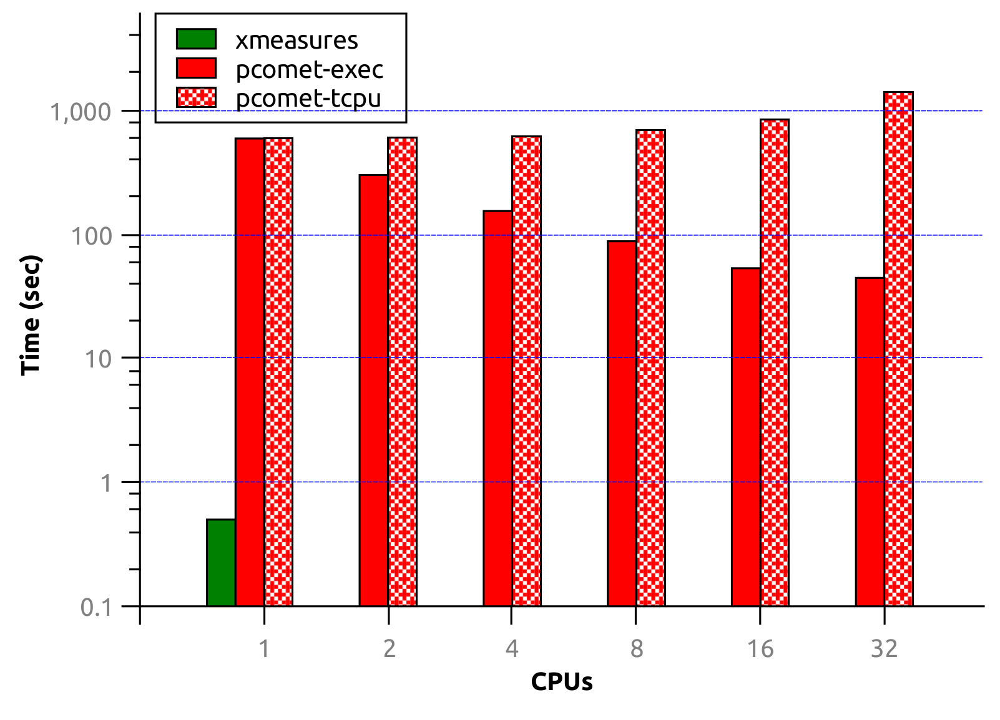

# xmeasures - Extrinsic Clustering Measures
Extremely fast evaluation of accuracy (extrinsic quality) measures for the [overlapping/fuzzy] clusterings (collections of groups of items):  
family of **[mean] F1 measures** (including Average F1-Score) and **Omega Index** *(fuzzy version of the Adjusted Rand Index)* for overlapping multi-resolution clusterings with unequal node base (and optional node base synchronization) using various matching policies (micro, macro and combined weighting),  
and standard **NMI** for non-overlapping clustering on a single resolution. `xmeasures` also provides clusters labeling with the indices of the ground-truth clusters considering 1:n match and evaluating F1, precision and recall of the labeled clusters.

`xmeasures` evaluates F1 and NMI for collections of hundreds thousands [overlapping] clusters (covers, communities) withing a dozen seconds on an ordinary laptop using a single CPU core. The computational time is O(N) <!-- O(N \* 2 \* s), where *s* is the average sharing ratio (membership) of the nodes, typically -> 1. -->
unlike O(N \* C) <!-- O(N \* (C + C')) for the average F1-score -->
of the existing state of the art implementations, where N is the number of nodes in the network and C is the number of clusters. Computational complexity for Omega Index is standard and equals O(N^2 \* s/2), where s is the average sharing ratio (membership) of the nodes, typically s -> 1.  
`xmeasures` is one of the utilities designed for the [PyCaBeM](https://github.com/eXascaleInfolab/PyCABeM) clustering benchmark to evaluate clusterings of large networks.

`The paper:` [Accuracy Evaluation of Overlapping and Multi-resolution Clustering Algorithms on Large Datasets](https://github.com/eXascaleInfolab/xmeasures/blob/master/docs/xmeasures.pdf)
```bibtex
@inproceedings{Xms19,
	author={Artem Lutov and Mourad Khayati and Philippe Cudr{\'e}-Mauroux},
	title={Accuracy Evaluation of Overlapping and Multi-resolution Clustering Algorithms on Large Datasets},
	booktitle={6th IEEE International Conference on Big Data and Smart Computing (BigComp 2019)},
	year={2019},
	keywords={accuracy metrics, overlapping community evaluation, multi-resolution clustering evaluation, Generalized NMI, Omega Index, MF1, similarity of collections of sets}
}
```

Related papers about the implemented measures:
  - [Omega Index](http://dx.doi.org/10.1207/s15327906mbr2302_6) ([fuzzy version of the Adjusted Rand Index](http://iopscience.iop.org/article/10.1088/1742-5468/2011/02/P02017/meta)), which equal to ARI when applied for the non-overlapping clusterings;
  - Mean F1 measures: [F1a (Average F1-Score)](https://cs.stanford.edu/people/jure/pubs/bigclam-wsdm13.pdf), F1p is much more indicative and discriminative than the presented there F1a but the respective paper has not been published yet;
  - [NMI measure](http://www.jmlr.org/papers/volume11/vinh10a/vinh10a.pdf).
    > Standard NMI is implemented considering overlapping and multi-resolution clustering only to demonstrate non-applicability of the standard NMI for such cases, where it yields unfair results. See [GenConvNMI](https://github.com/eXascaleInfolab/GenConvNMI) for the fair generalized NMI evaluation.

The execution time and the total processing time (relative power consumption) of `xmeasures` on a single CPU core vs [ParallelComMetric](https://github.com/eXascaleInfolab/ParallelComMetric) on multiple SMP cores evaluated on the SNAP DBLP dataset and shown in the log scale demonstrates that `xmeasures` evaluates F1 family measures multiple orders of magnitude faster than other state-of-the-art solutions:



Author:  (c) Artem Lutov <artem@exascale.info>

## Content
- [Deployment](#deployment)
	- [Requirements](#requirements)
	- [Compilation](#compilation)
- [Usage](#usage)
- [Related Projects](#related-projects)

# Deployment

The target platform is NIX/Posix, the binary is compiled for Linux Ubuntu x64 and also should work on Windows 10+ x64 (see details in [this article](https://www.howtogeek.com/249966/how-to-install-and-use-the-linux-bash-shell-on-windows-10/)).

## Requirements
There are no any requirements for the execution or compilation except the *standard C++ library*.

To run the *prebuilt executable* on Linux Ubuntu 16.04 x64, the standard library can be installed by: `$ sudo apt-get install libstdc++6`.

## Compilation
```
$ make release
```
To update/extend the input parameters modify `args.ggo` and run `GenerateArgparser.sh` (calls `gengetopt`) before running `make`. To install [*gengetopt*](https://www.gnu.org/software/gengetopt) execute: `$ sudo apt-get install gengetopt`.

> Build errors might occur if the default *g++/gcc <= 5.x*.  
Then `g++-5` should be installed and `Makefile` might need to be edited replacing `g++`, `gcc` with `g++-5`, `gcc-5`.

# Usage
Execution Options:
```
$ ../xmeasures -h
xmeasures 4.0.4

Extrinsic measures evaluation: Omega Index (a fuzzy version of the Adjusted
Rand Index, identical to the Fuzzy Rand Index) and [mean] F1-score (prob, harm
and avg) for the overlapping multi-resolution clusterings, and standard NMI for
the non-overlapping clustering on a single resolution. Unequal node base is
allowed in the evaluating clusterings and optionally can be synchronized
removing nodes from the clusters missed in one of the clusterings
(collections).

Usage: xmeasures [OPTIONS] clustering1 clustering2

  clustering  - input file, collection of the clusters to be evaluated.
  
Examples:
  $ ./xmeasures -fp -kc networks/5K25.cnl tests/5K25_l0.825/5K25_l0.825_796.cnl
  $ ./xmeasures -fh -kc -i tests/5K25.cll -ph -l networks/5K25.cnl
tests/5K25_l0.825/5K25_l0.825_796.cnl
  $ ./xmeasures -ox tests/clsevalsx/omega_c4.3-1.cnl
tests/clsevalsx/omega_c4.3-2.cnl


Extrinsic measures are evaluated, i.e. two input clusterings (collections of
clusters) are compared to each other. Optionally, a labeling of the evaluating
clusters with the specified ground-truth clusters is performed.
NOTE:
  - Multiple evaluating measures can be specified.
  - Each cluster should contain unique members, which is ensured only if the
'unique' option is specified.
  - All clusters should be unique to not affect Omega Index evaluation, which
can be ensured by the [resmerge](https://github.com/eXascaleInfolab/resmerge)
utility.
  - Non-corrected unequal node base in the clusterings is allowed, it penalizes
the match.Use [OvpNMI](https://github.com/eXascaleInfolab/OvpNMI) or
[GenConvNMI](https://github.com/eXascaleInfolab/GenConvNMI) for NMI evaluation
in the arbitrary collections (still each cluster should contain unique
members).

Evaluating measures are:
  - OI  - Omega Index (a fuzzy version of the Adjusted Rand Index, identical to
the Fuzzy Rand Index), which yields the same value as Adjusted Rand Index when
applied to the non-overlapping clusterings.
  - [M]F1  - various [mean] F1 measures of the Greatest (Max) Match including
the Average F1-Score (suggested by J. Leskovec) with the optional weighting.
NOTE: There are 3 matching policies available for each kind of F1. The most
representative evaluation is performed by the F1p with combined matching
policy (considers both micro and macro weighting).
  - NMI  - Normalized Mutual Information, normalized by either max or also
sqrt, avg and min information content denominators.
ATTENTION: This is a standard NMI, which should be used ONLY for the HARD
partitioning evaluation (non-overlapping clustering on a single resolution).
It penalizes overlapping and multi-resolution structures.


  -h, --help                    Print help and exit
  -V, --version                 Print version and exit
  -O, --ovp                     evaluate overlapping instead of the
                                  multi-resolution clusters, where max matching
                                  for any shared member between R overlapping
                                  clusters is 1/R (the member is shared)
                                  instead of 1 (the member fully belongs to
                                  each [hierarchical  sub]group) for the member
                                  belonging to R distinct clusters on R
                                  resolutions.
                                  NOTE: It has no effect for the Omega Index
                                  evaluation.  (default=off)
  -q, --unique                  ensure on loading that all cluster members are
                                  unique by removing all duplicates.
                                  (default=off)
  -s, --sync=filename           synchronize with the specified node base
                                  omitting the non-matching nodes.
                                  NOTE: The node base can be either a separate,
                                  or an evaluating CNL file, in the latter case
                                  this option should precede the evaluating
                                  filename not repeating it
  -m, --membership=FLOAT        average expected membership of the nodes in the
                                  clusters, > 0, typically >= 1. Used only to
                                  facilitate estimation of the nodes number on
                                  the containers preallocation if this number
                                  is not specified in the file header.
                                  (default=`1')
  -d, --detailed                detailed (verbose) results output
                                  (default=off)

Omega Index:
  -o, --omega                   evaluate Omega Index (a fuzzy version of the
                                  Adjusted Rand Index, identical to the Fuzzy
                                  Rand Index and on the non-overlapping
                                  clusterings equals to ARI).  (default=off)
  -x, --extended                evaluate extended (Soft) Omega Index, which
                                  does not excessively penalize distinctly
                                  shared nodes.  (default=off)

Mean F1:
  -f, --f1[=ENUM]               evaluate mean F1 of the [weighted] average of
                                  the greatest (maximal) match by F1 or partial
                                  probability.
                                  NOTE: F1h <= F1a, where:
                                   - p (F1p or Ph)  - Harmonic mean (F1) of two
                                  [weighted] averages of the Partial
                                  Probabilities, the most indicative as
                                  satisfies the largest number of the Formal
                                  Constraints (homogeneity, completeness and
                                  size/quantity except the rag bag in some
                                  cases);
                                   - h (F1h)  - Harmonic mean (F1) of two
                                  [weighted] averages of all local F1 (harmonic
                                  means of the Precision and Recall of the best
                                  matches of the clusters);
                                   - a (F1a)  - Arithmetic mean (average) of
                                  two [weighted] averages of all local F1, the
                                  least discriminative and satisfies the lowest
                                  number of the Formal Constraints.
                                  Precision and recall are evaluated relative
                                  to the FIRST clustering dataset
                                  (ground-truth, gold standard).
                                    (possible values="partprob",
                                  "harmonic", "average" default=`partprob')
  -k, --kind[=ENUM]             kind of the matching policy:
                                   - w  - Weighted by the number of nodes in
                                  each cluster (known as micro weighting,
                                  MF1_micro)
                                   - u  - Unweighed, where each cluster is
                                  treated equally (known as macro weighting,
                                  MF1_macro)
                                   - c  - Combined(w, u) using geometric mean
                                  (drops the value not so much as harmonic
                                  mean)
                                    (possible values="weighted",
                                  "unweighed", "combined"
                                  default=`weighted')

Clusters Labeling & F1 evaluation with Precision and Recall:
  -l, --label=gt_filename       label evaluating clusters with the specified
                                  ground-truth (gt) cluster indices and
                                  evaluate F1 (including Precision and Recall)
                                  of the (best) MATCHED labeled clusters only
                                  (without the probable subclusters).
                                  NOTE: If 'sync' option is specified then the
                                  file name of the clusters labels should be
                                  the same as the node base (if specified) and
                                  should be in the .cnl format. The file name
                                  can be either a separate or an evaluating CNL
                                  file, in the latter case this option should
                                  precede the evaluating filename not repeating
                                  it.
                                  Precision and recall are evaluated relative
                                  to the FIRST clustering dataset
                                  (ground-truth, gold standard).

  -p, --policy[=ENUM]           Labels matching policy:
                                   - p  - Partial Probabilities (maximizes
                                  gain)
                                   - h  - Harmonic Mean (minimizes loss,
                                  maximizes F1)
                                    (possible values="partprob", "harmonic"
                                  default=`harmonic')
  -u, --unweighted              Labels weighting policy on F1 evaluation:
                                  weighted by the number of instances in each
                                  label by default (micro weighting, F1_micro)
                                  or unweighed, where each label is treated
                                  equally (i.e. macro weighting, F1_macro)
                                  (default=off)
  -i, --identifiers=labels_filename
                                output labels (identifiers) of the evaluating
                                  clusters as lines of space-separated indices
                                  of the ground-truth clusters (.cll - clusters
                                  labels list)
                                  NOTE: If 'sync' option is specified then the
                                  reduced collection is outputted to the
                                  <labels_filename>.cnl besides the
                                  <labels_filename>

NMI:
  -n, --nmi                     evaluate NMI (Normalized Mutual Information),
                                  applicable only to the non-overlapping
                                  clusters  (default=off)
  -a, --all                     evaluate all NMIs using sqrt, avg and min
                                  denominators besides the max one
                                  (default=off)
  -e, --ln                      use ln (exp base) instead of log2 (Shannon
                                  entropy, bits) for the information measuring
                                  (default=off)
```

> Empty lines and comments (lines starting with #) in the input file (cnl format) are omitted.

**Examples**  
Evaluate harmonic mean of the weighted average of the greatest (maximal) match by partial probabilities (the most discriminative F1-measure) using macro weighting (default as the most frequently used, thought combined weighting is the most indicative one):
```
$ ./xmeasures -f data/3cls5nds.cnl data/4cls6nds.cnl
```

Evaluate harmonic mean of the weighted average (by the cluster size) of the greatest (maximal) match by F1s and insure than all cluster members are unique (the duplicated members are removed):
```
$ ./xmeasures -fh -q data/3cls5nds.cnl data/4cls6nds.cnl
```

Evaluate harmonic mean of the [unweighted] average of the greatest (maximal) match by partial probabilities and synchronize the node base with the first evaluating collection, and considering overlapping clusters instead of multi-resolutions (`-O` does not matter for the case of non-overlapping single resolution collections):
```
$ ./xmeasures -sku -fp -O data/3cls5nds.cnl data/4cls6nds.cnl
```

Evaluate arithmetic mean of the weighted average (by the cluster size) of the greatest (maximal) match by F1s and  NMI with all denominators synchronizing node base of the evaluating collections with `1lev4nds2cls.cnl`:
```
$ ./xmeasures -fa -na -s data/1lev4nds2cls.cnl data/3cls5nds.cnl data/4cls6nds.cnl
```

Evaluate combined weighed and unweighted F1h (harmonic mean of the average F1s), label the clusters with the indices of provided labels, evaluate standard F1, precision and recall of the labeled clusters and output the labels to the `clslbs.cll`:
```
$ ./xmeasures -fh -kc -i clslbs.cll -l labels.cnl clusters.cnl
```

Evaluate extended Omega Index and mean F1h (harmonic mean of the weighted average of the greatest (maximal) match by F1):
```
$ ./xmeasures -ox -fh omega_c4.3-1.cnl omega_c4.3-2.cnl
```

**Note:** Please, [star this project](https://github.com/eXascaleInfolab/xmeasures) if you use it.

# Related Projects
- [GenConvNMI](https://github.com/eXascaleInfolab/GenConvNMI) - Overlapping NMI evaluation that is compatible with the original NMI and suitable for both overlapping and multi resolution (hierarchical) clustering evaluation.
- [OvpNMI](https://github.com/eXascaleInfolab/OvpNMI)  - NMI evaluation for the overlapping clusters (communities) that is not compatible with the standard NMI value unlike GenConvNMI, but it is much faster than GenConvNMI.
- [Clubmark](https://github.com/eXascaleInfolab/clubmark) - A parallel isolation framework for benchmarking and profiling clustering (community detection) algorithms considering overlaps (covers).
- [ParallelComMetric](https://github.com/eXascaleInfolab/ParallelComMetric) - A parallel toolkit implemented with Pthreads (or MPI) to calculate various extrinsic and intrinsic quality metrics (with and without ground truth community structure) for non-overlapping (hard, single membership) clusterings.
- [CluSim](https://github.com/Hoosier-Clusters/clusim) - A Python module that evaluates (slowly) various extrinsic quality metrics (accuracy) for non-overlapping (hard, single membership) clusterings.
- [resmerge](https://github.com/eXascaleInfolab/resmerge)  - Resolution levels clustering merger with filtering. Flattens hierarchy/list of multiple resolutions levels (clusterings) into the single flat clustering with clusters on various resolution levels synchronizing the node base.
- [ExecTime](https://bitbucket.org/lumais/exectime/)  - A lightweight resource consumption profiler.
- [TInfES](https://github.com/eXascaleInfolab/TInfES)  - Type inference evaluation scripts and accessory apps used for the benchmarking.
